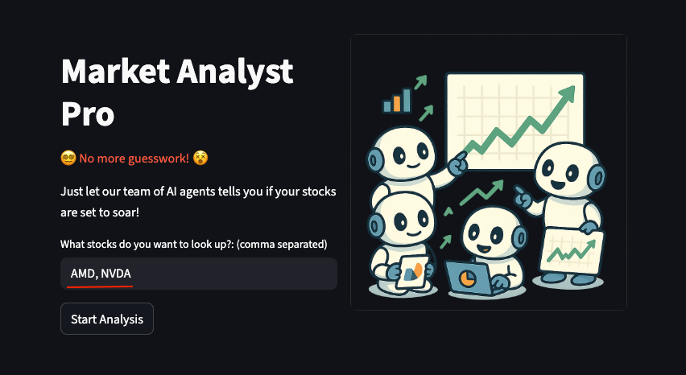
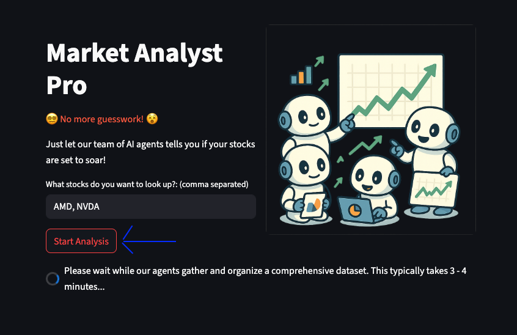
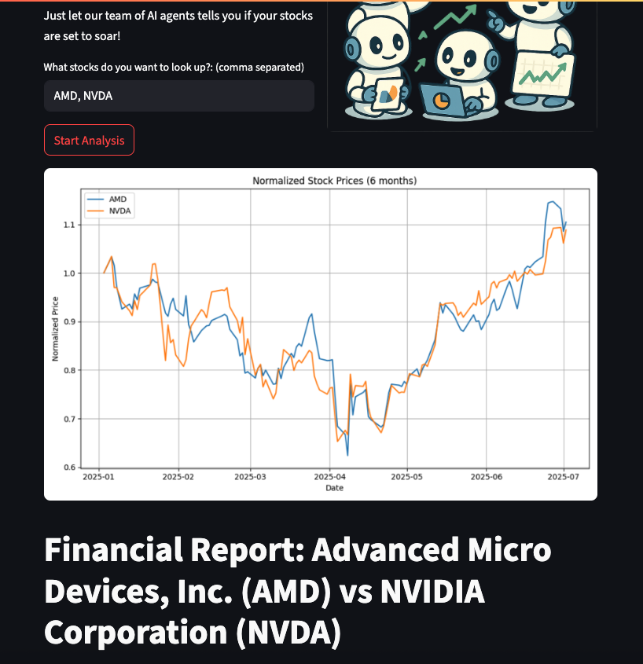
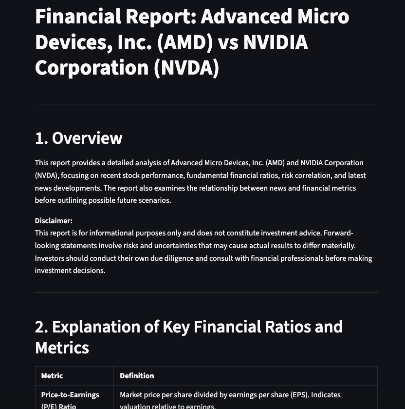
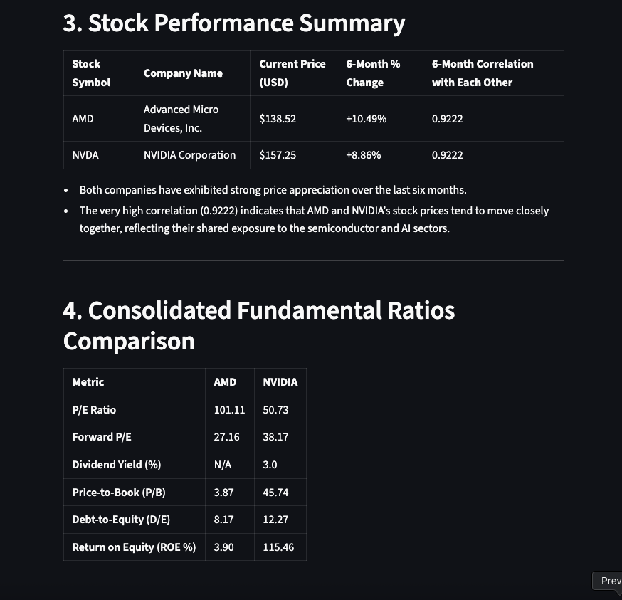
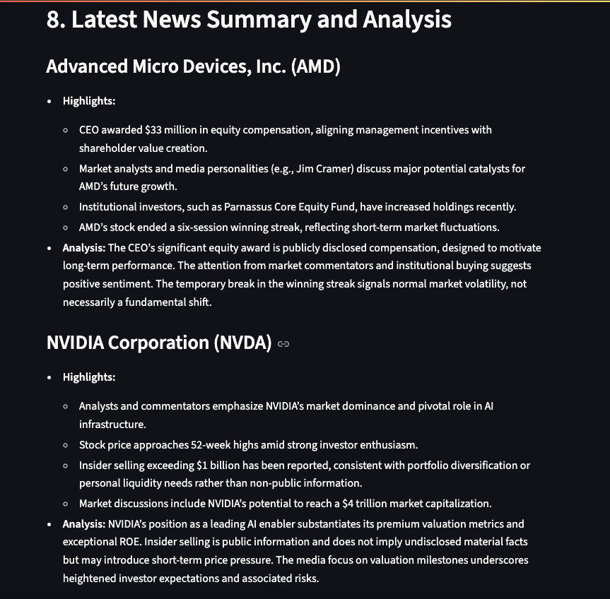
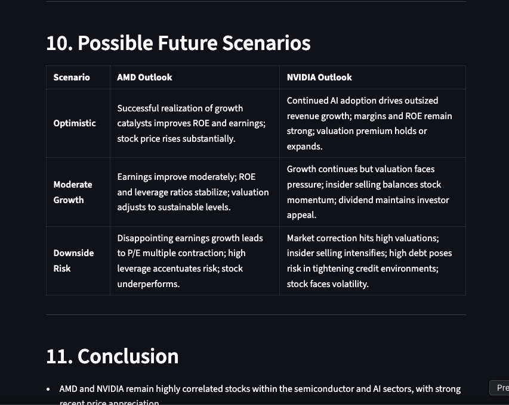

# Market Analyst Pro

Market Analyst Pro is a multi-agent AI dashboard that delivers data-driven stock analysis and future outlooks to help investors make smarter decisions.

## Key Features

1. **6-Month Performance Tracking**  
   View each stock’s price history and percentage change over the past 6 months.

2. **Side-by-Side Comparison**  
   Instantly compare multiple tickers on the same metrics and charts.

3. **Fundamental Analysis**  
   - Price-to-Earnings (P/E)  
   - Forward P/E  
   - Dividend Yield  
   - Price-to-Book  
   - Debt-to-Equity  
   - Return on Equity (ROE)

4. **News & Sentiment Insights**  
   Pull in the latest headlines and summarize market sentiment for your selected assets.

5. **Future Outlook Projections**  
   Generate scenario-based forecasts and risk analyses to anticipate potential price movements.

## How to Use
1. Type in stocks that you want to analyze. It should be the full name of the stock or ticker symbol (e.g. NVDA, TSLA), comma separated if multiple stocks.

2. Click on the Start Analysis button and wait a few minutes while the agents are carrying out the step by step data analysis process.

3. When the analysis is complete, the result will come down on the screen in an organized format, for example:

## Technology Stack

- **Programming Language:** Python 3.8+  
- **AI Agent Orchestration:** Autogen (OpenAI Agent SDK)  
- **Large Language Model API:** OpenAI GPT-4.1-mini via OpenAI API (you can pick any model you would like.) 
- **Web Application Framework:** Streamlit  
- **Dependencies & Packaging:** pip, virtual environments, `requirements.txt`

## Note
Unnecessarily, there are a lot of required modules listed inside the requirements.txt file. That's because this app shares 
the virtual environment with the LLM agents (the agents also generate required code for the delivery of stock analysis). 
If you don't want the overwhelming number of modules installed in your venv, it's recommended to separate your virtual environments
into 2 sections -- one for the core app, another for the LLM agents that install their own modules for code generation. 

